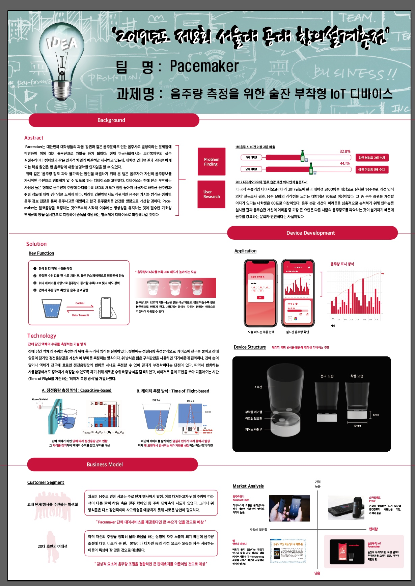
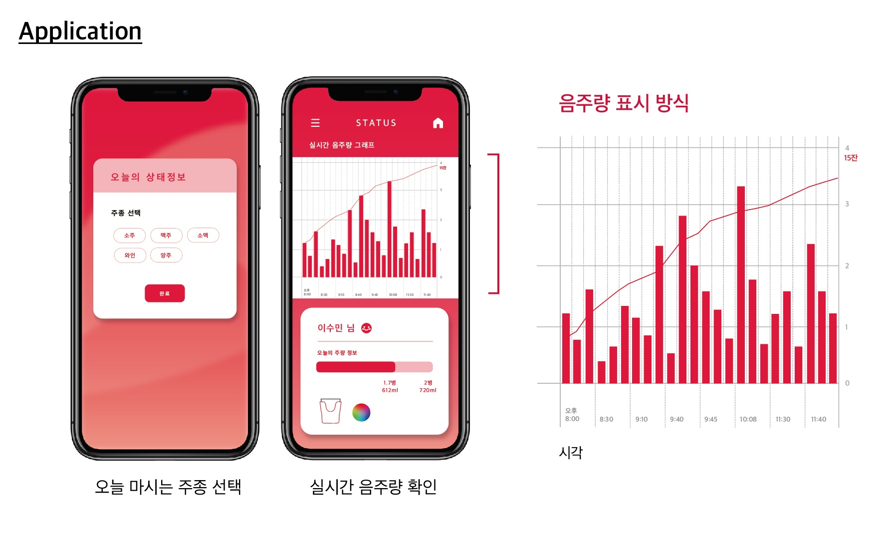

# pacemaker

Pacemaker is an application that controls the device and manipulates the data received from the device. It provides help to people who have difficulty in managing their drinking habit, through visualizing the amount of alcohol they already had by graph in the application and LED light on the device. The data is received from the device through bluetooth. 

### Full project Explanation

---

### Application Feature

---

Able to change color of LED light through color picker. 

### Requirements

---

**Minimum Sdk Version:** 22

**Tested Device:**  Galaxy S6

### Used APIs

---

Chart API: https://github.com/PhilJay/MPAndroidChart

Color Picker API: https://github.com/skydoves/ColorPickerView

